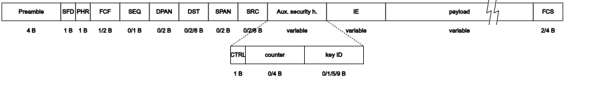

# framedraw

Simple python script to generate IEEE style frame figures in svg.

Depends on [svgwrite](https://pypi.org/project/svgwrite/).

## Usage

python framedraw.py <input.yaml>

There's practically no error handling in the script, so some knowledge of python
is required to decrypt errors.

## Example

[154frame.yml](154frame.yml) genearates the following figure, which is an
approximation of the IEEE 802.15.4 frame format:

The markdown renderer here seems to be cutting the right side of the drawing, so
the above is a png screenshot. For the original SVG, please [use github's "raw"
mode.](https://raw.githubusercontent.com/andrasbiro/framedraw/main/IEEE802154.svg)

## YAML format

All the tags in the yaml are lowercase. Each yml should start with a `global`
formatting field followed by the frame description under `frame`

### Global fields

* `name`: the filename to generate
* `unitsize`: The width of each unit in pixel (i.e., how many pixels is drawn
  for a byte). Recommended: 25
* `height`: The height of the frame drawing rectangles. Recommended: 30
* `fontsize`: Font size for all fonts. Recommended: 10
* `fontfamily`: Font family for all fonts. Recommended: 10
* `topspace`: Space from the top of the canvas. Recommended: 7
* `bottomspace`: Space under the frame rectangle. Recommended: 7
* `leftspace`: Space left from the frame rectnagle. Recommended: 5
* `withsize`: Set it to `True` to write the size under the frame (otherwise size
  is only represented with drawing width)
* `sizeunit`: Unit to print after the size, with leading spaces. E.g., `" B"`
* `subfrmaespacing`: disatnace between subframes, including main frame and first
  subframe. Recommended: 80

### Frame fields

Frame is an array of frame elements, drawn in order from left to right, each
must have at least:

* `name`: The name of the frame element, drawn in the middle of its rectangle
* `size`: Unless `drawsize` is specified, defines the width of the rectangle
  (`size * unitsize`), and if `withsize` is `True`, printed under the rectangle.
  Must be numerical unless `drawsize`` is specified.

#### Optional fields:

* `sizeunit`: If specified, replaces the `sizeunit` in `global`
* `drawsize`: If specified, replaces size to define the width of the rectangle.
  Must be numerical.
* `cut`: Cuts the frame with "arrows" around the defined location. E.g., if
  `size`/`drawsize` is 10, a `cut` at 7 will cut the element around 70% of it
  width

#### Subframes

Under a `frame` element, a subframe can be defined. This will be connected to
the frame element with dotted lines. For a subframe, the following is required:

* `subframerow`: The row to draw the given subframe. Row 0 is the main frame, so
  the first subframe(s) should be in row 1.
* `subframe`: Works exactly the same as `frame`, so a list of frame elements
  should be defined under it

The system is written recursively, so subframes of subframes is possible.

## Future plans

There are none. I just needed a quick and dirty tool to draw frames for
documentation and I was fed up doing it with rectangles and textboxes. But this
is good enough for me. If you want something better, fork the code.